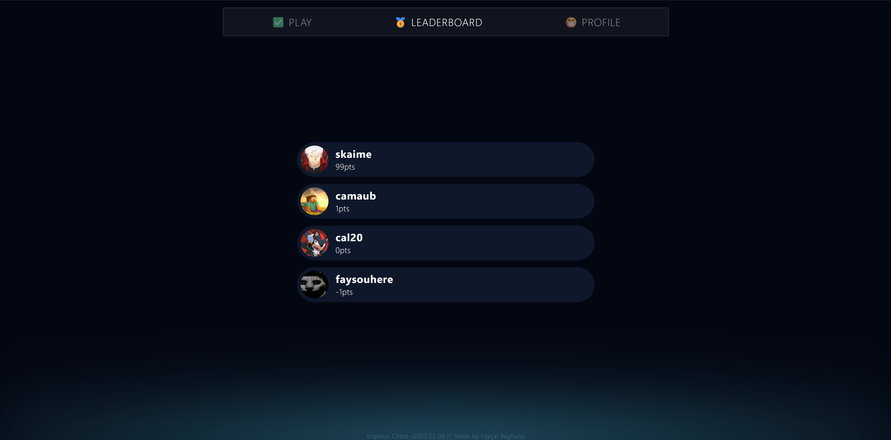
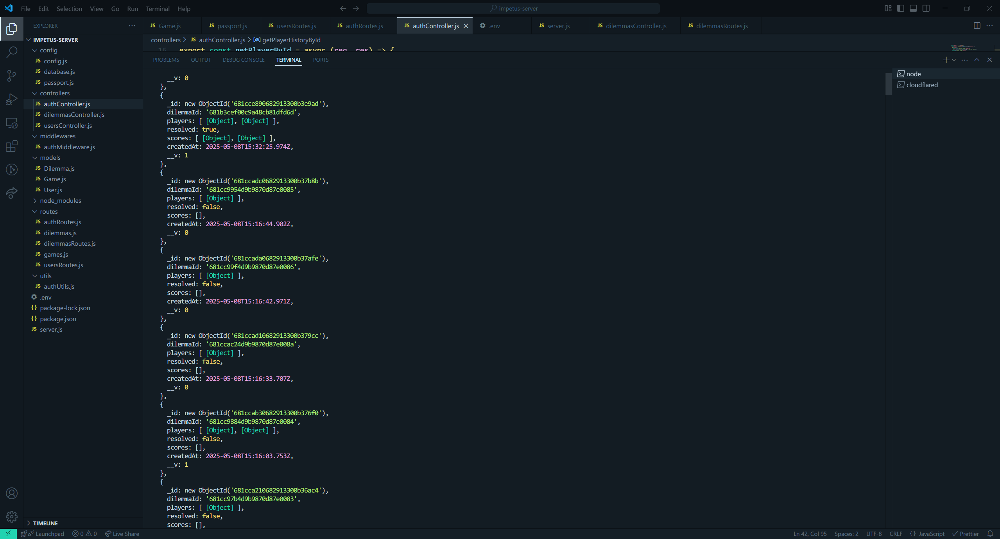

# Dilemma Game

A real-time multiplayer dilemma game where players make choices with social consequences. Inspired by psychological experiments and classic "prisoner's dilemma"-style decision-making, the game is playable directly via Discord OAuth and designed for fun, quick sessions.

## 🧠 Game Concept

Players are presented with moral or strategic dilemmas. Each player must choose an option, and the resulting combination determines how points are distributed. Outcomes depend on everyone’s choices and are pre-defined per dilemma.

## ⚙️ Tech Stack

### Client

- Vite + Svelte
- TailwindCSS
- Discord OAuth

### Server

- Express.js (Node.js)
- MongoDB (Mongoose)
- JWT Authentication

## 📦 Features

- Discord authentication
- Score tracking and history
- Configurable dilemmas via `config.json` or database
- Responsive UI with subtle animations

## 📸 Images

